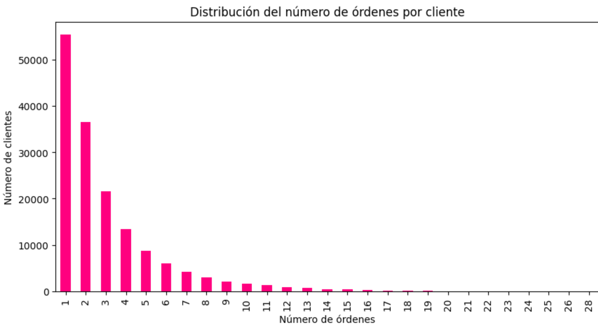

# 01-instacart-customer
INSTACART CUSTOMER BEHAVIOR ANALYSIS

## Descripción del proyecto 

Este proyecto realiza un análisis exploratorio de datos (EDA) sobre el comportamiento de compra de clientes en una plataforma de e-commerce (Instacart), con el fin de identificar patrones de consumo, recurrencia y tendencias de productos.

## Problema de negocio
Las plataformas de e-commerce necesitan entender:
- Cuándo compran los clientes
- Qué productos generan recurrencia
- Cómo optimizar inventario y ventas

## Objetivo
Analizar el comportamiento de compra para identificar patrones que permitan mejorar:
- Planeación de inventario
- Estrategias de recomendación
- Predicción de demanda

 ## Mi contribución
 - Limpieza y validación completa de datos
 - Análisis exploratorio enfocado en comportamiento del cliente
 - Identificación de patrones de recompra
 - Generación de visualizaciones claras para toma de decisiones

## Análisis realizado
- Pedidos por hora del día
- Pedidos por día de la semana
- Tiempo entre órdenes
- Productos más comprados
- Análisis de recompra
- Comportamiento del carrito

## Insights clave
- Mayor volumen de pedidos entre 10 AM y 3 PM
- Fines de semana presentan picos de demanda
- Alta recurrencia en productos específicos (indicador de fidelización)
- Clientes tienden a repetir productos en ciclos cortos

## Impacto en negocio
Este análisis permite:
- Optimizar inventarios según horarios y demanda
- Identificar productos “core” para ingresos recurrentes
- Mejorar sistemas de recomendación

## Enfoque financiero (diferenciador)
- Identificación de productos con flujo de ingresos recurrente
- Apoyo en forecasting de demanda
- Segmentación de clientes de alto valor

## Tecnologías
- Python
- Pandas
- Matplotlib / Seaborn
- Jupyter Notebook

## Evidencia visual
Cantidad de ordenes que hace un cliente

## Aprendizajes
- Importancia de la calidad de datos en análisis de comportamiento
- Cómo traducir datos en decisiones de negocio
- Identificación de patrones de consumo reales

